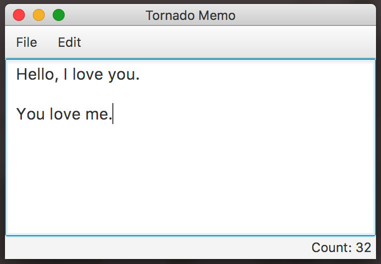

# Tornado Memo

This is the sample application using TornadoFX with MVC (Model-View-Controller) design pattern.

You will know how to construct an app with TornadoFX.

# Links

* [**TornadoFX**](https://github.com/edvin/tornadofx)
* [TornadoFX Samples](https://github.com/edvin/tornadofx-samples)
* [**Kotlin**](http://kotlinlang.org/)
